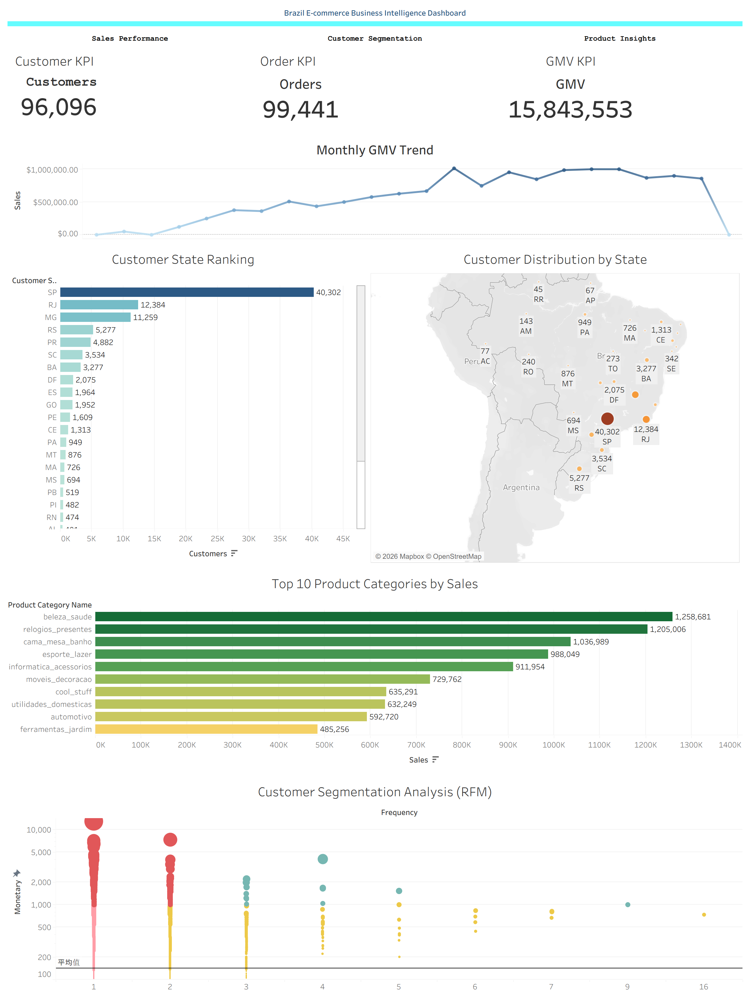

# 🇧🇷 巴西电商用户行为分析

这是一个基于 **Brazilian Olist E-commerce Dataset（巴西 Olist 电商数据集）** 的端到端商业智能分析项目。

项目覆盖了从原始数据处理、MySQL 数据库存储、SQL 商业分析、Python 探索性数据分析、RFM 用户分层，到 Tableau 可视化仪表盘开发的完整数据分析流程。



## 项目流程

```text
原始 CSV 数据
      ↓
Python 数据导入
      ↓
MySQL 数据库
      ↓
SQL 商业分析
      ↓
Python EDA 与 RFM 用户分层
      ↓
Tableau 仪表盘与商业洞察
```

## 项目目录

| 模块 | 说明 |
| --- | --- |
| [`data/raw`](data/raw) | 原始 Olist CSV 数据集 |
| [`data/processed`](data/processed) | 清洗及处理后的用户分层数据 |
| [`mysql`](mysql) | 数据库表结构与导入 SQL |
| [`python`](python) | 数据导入、EDA 与结果导出脚本 |
| [`sql`](sql) | 商业分析 SQL 查询与视图 |
| [`report`](report) | 生成的 CSV 分析结果 |
| [`tableau`](tableau) | Tableau 工作簿与 Dashboard 预览图 |

## 核心业务问题

本项目主要围绕以下业务问题展开：

- 销售额和订单量随时间如何变化？
- 哪些商品类别和商品贡献了最多收入？
- 客户主要集中在哪些地区？
- 哪些支付方式最重要？
- 哪些客户属于高价值客户、忠诚客户或新客户？
- 有多少客户发生了重复购买？

## 技术栈

- Python
- Pandas
- SQLAlchemy
- PyMySQL
- MySQL
- SQL
- Tableau
- Git
- GitHub

## 本地运行项目

### 1. 安装 Python 依赖

```powershell
python -m venv .venv
.\.venv\Scripts\Activate.ps1
python -m pip install -r requirements.txt
```

### 2. 配置 MySQL

首先使用以下 SQL 文件创建数据库和数据表：

[`mysql/create_tables.sql`](mysql/create_tables.sql)

然后复制示例环境变量文件：

```powershell
Copy-Item .env.example .env
```

打开 `.env` 文件，将：

```text
replace_with_your_password
```

替换为你本地 MySQL 的密码。

`.env` 文件已经排除在 Git 跟踪之外，不应上传到 GitHub 仓库。

### 3. 导入并分析数据

在项目根目录运行：

```powershell
python .\python\01_import_mysql.py
python .\python\02_eda_analysis.py
```

创建以下 SQL 分析视图：

[`sql/03_sql_analysis.sql`](sql/03_sql_analysis.sql)

之后运行：

```powershell
python .\python\03_export_sql_result.py
```

导出 SQL 分析结果。

项目中的 Python 脚本均使用相对路径，因此项目克隆到其他本地目录后也可以正常运行。

## 主要分析结果

项目最终生成以下核心分析结果：

- KPI 汇总：客户数量、订单数量、GMV、平均订单金额
- 月度销售趋势
- 商品与品类表现分析
- 客户地域分布
- 支付方式分析
- 复购分析
- RFM 用户分层

生成的结果文件位于：

[`report`](report)

以及：

[`report/sql_result`](report/sql_result)

## Tableau 仪表盘

Tableau Dashboard 主要包括：

- 核心 KPI 指标卡
- 月度销售趋势
- 商品品类表现
- 客户区域分布
- 支付方式分析
- RFM 用户分层

### Dashboard 预览


### 项目文件

- [Dashboard 图片](tableau/Dashboard.png)
- [Tableau 工作簿](tableau/Brazil_Ecommerce_Dashboard.twb)

GitHub 可以直接预览 Dashboard 图片。

如果需要使用筛选器和其他交互功能，可以在 Tableau Desktop 中打开工作簿，或者将项目发布到 Tableau Public。

## 数据集说明

本项目使用公开的 **Olist Brazilian E-commerce Dataset**。

数据集主要包括：

- Orders
- Order Items
- Customers
- Products
- Payments
- Reviews
- Sellers
- Geolocation
- Product Category Translation

其中 Geolocation CSV 文件大小约为 58 MB。

GitHub 可以正常存储该文件，但由于文件较大，网页端可能无法完整预览表格内容，仍然可以正常下载使用。

## 项目亮点

- 完整的端到端数据分析流程
- Python + MySQL 数据处理工作流
- 多表 SQL 商业分析
- 商业 KPI 指标设计
- 探索性数据分析（EDA）
- RFM 客户价值分层
- Tableau 商业可视化 Dashboard
- Git / GitHub 项目管理
- 使用环境变量管理数据库配置，避免上传敏感信息

## 作者

**xsoou123**

数据分析作品集项目

技术栈：

`Python` `SQL` `MySQL` `Tableau`
